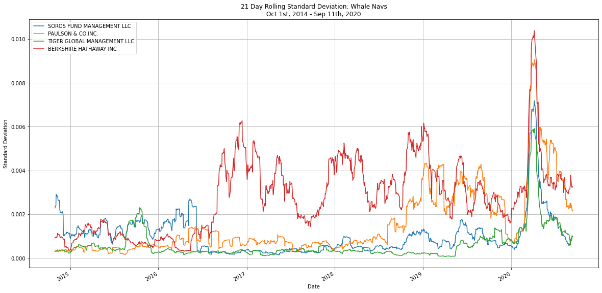
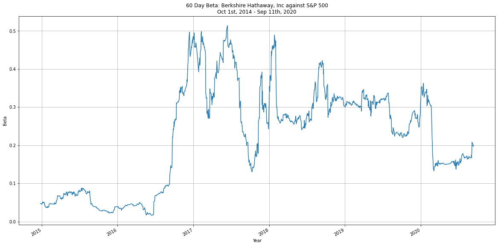
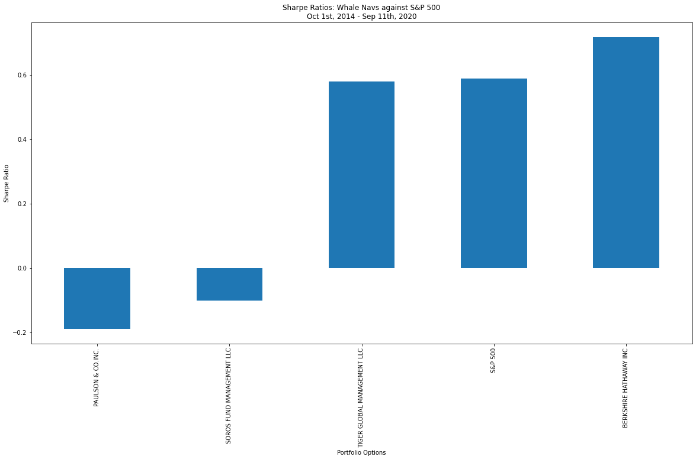

# Fintech Client Portfolio Analysis

Analysis of four investment options for potential inclusion in client portfolios to determine the one with the most investment potential based on key risk-management metrics such as daily returns, standard deviations, Sharpe ratios, and betas.

## Technologies

The application uses the following technologies:

- Python 3.7
- [pandas](https://pandas.pydata.org/pandas-docs/stable/index.html)
- [Jupyter Lab](https://jupyter.org/)

## Installation Guide

```python

pip install numpy
pip install pandas
pip install matplotlib

```

### Jupyter

The application is based on a Jupyter Notebook. The minimum required is a Jupyter Notebook but Jupyter Lab can be installed as well.  Please review the [Jupyter installation instructions](https://jupyter.org/install)

## Usage

### Startup

- Launch Jupyter
- Load **risk_return_analysis.ipynb** and select **Run => Restart Kernal and Run all Cells** from the menu

### Inputs

A Comma Separated Values (.CSV) file containing the closing prices of Soros Fund Management, LLC; Paulson and Company,
Inc; Tiger Global Management, LLC; Berkshire Hathaway, Inc; and the S&P 500 between October 1st, 2014 and September
11th, 2020.

### Analsyis Output Examples

The data was loaded into a pandas DataFrame and various types of analysis was conducted to determine the
best portfolio to incldue as an option for the firm's clients.  Types of analysis included:

- Daily returns and cumulative daily return calculations
- Volatility analysis through standard deviation and annualized standard deviation
- Risk/reward analysis through Sharpe Ratio calculation and visualization
- Market risk analysis through variance, covariance, and beta calculations against the S&P 500







## Brief Analysis Review

Analysis of the four portfolios has led to the recommendation of Berkshire Hathaway, Inc for inclusion into the firm's suite of fund offerings.  Across all of the options, Berkshire Hathaway, Inc. with a Sharpe Ratio of 0.718 offers the best risk-return profile.  It also has the highest cumulative return across the four options while offering a lower risk than
the S&P 500.

## Contributors

- Jacob Rougeau

## License

MIT
